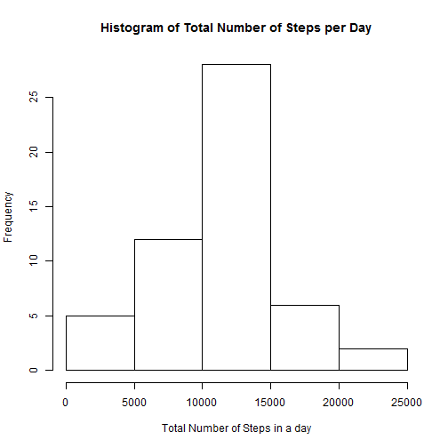
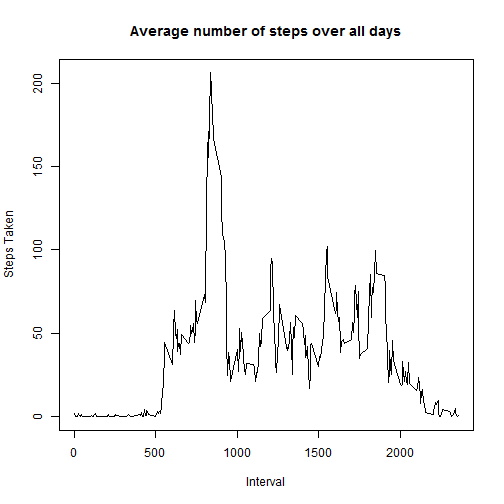
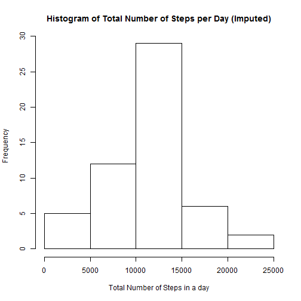
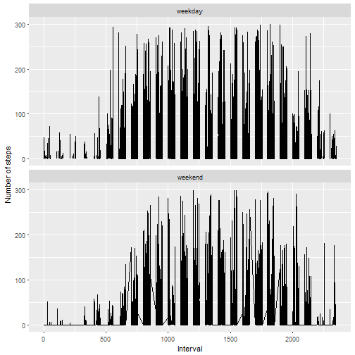

Reproducible Research
Project 1
=========================================================


First, set the working directory


```r
setwd("C:/Users/Peter/Desktop/Data Science/Coursera/ReproducibleResearch")
```

#Loading and preprocessing the data


```r
url <-"https://d396qusza40orc.cloudfront.net/repdata%2Fdata%2Factivity.zip"

download.file(url,destfil="activity.zip")
unzip("ActivityData.zip", overwrite=TRUE)
data <- read.csv("activity.csv")
```
Now check the data to see that it is downloaded properly


```r
head(data)
```

```
##   steps       date interval
## 1    NA 2012-10-01        0
## 2    NA 2012-10-01        5
## 3    NA 2012-10-01       10
## 4    NA 2012-10-01       15
## 5    NA 2012-10-01       20
## 6    NA 2012-10-01       25
```

```r
names(data)
```

```
## [1] "steps"    "date"     "interval"
```

```r
str(data)
```

```
## 'data.frame':	17568 obs. of  3 variables:
##  $ steps   : int  NA NA NA NA NA NA NA NA NA NA ...
##  $ date    : Factor w/ 61 levels "2012-10-01","2012-10-02",..: 1 1 1 1 1 1 1 1 1 1 ...
##  $ interval: int  0 5 10 15 20 25 30 35 40 45 ...
```
The data would be easier to use without the missing values

```r
good_data <- data[complete.cases(data),]
```


#What is the mean total number of steps taken per day?
You may ignore missing values
1. Calulate the total number of steps taken per day

```r
#First convert the date to a factor variable
good_data$date <- factor(good_data$date)
#check the levels
levels(good_data$date)
```

```
##  [1] "2012-10-02" "2012-10-03" "2012-10-04" "2012-10-05" "2012-10-06"
##  [6] "2012-10-07" "2012-10-09" "2012-10-10" "2012-10-11" "2012-10-12"
## [11] "2012-10-13" "2012-10-14" "2012-10-15" "2012-10-16" "2012-10-17"
## [16] "2012-10-18" "2012-10-19" "2012-10-20" "2012-10-21" "2012-10-22"
## [21] "2012-10-23" "2012-10-24" "2012-10-25" "2012-10-26" "2012-10-27"
## [26] "2012-10-28" "2012-10-29" "2012-10-30" "2012-10-31" "2012-11-02"
## [31] "2012-11-03" "2012-11-05" "2012-11-06" "2012-11-07" "2012-11-08"
## [36] "2012-11-11" "2012-11-12" "2012-11-13" "2012-11-15" "2012-11-16"
## [41] "2012-11-17" "2012-11-18" "2012-11-19" "2012-11-20" "2012-11-21"
## [46] "2012-11-22" "2012-11-23" "2012-11-24" "2012-11-25" "2012-11-26"
## [51] "2012-11-27" "2012-11-28" "2012-11-29"
```

```r
#aggregate the sums to make a table
table_steps <- aggregate(steps~date,good_data,sum)
table_steps #date is first col, steps is 2nd
```

```
##          date steps
## 1  2012-10-02   126
## 2  2012-10-03 11352
## 3  2012-10-04 12116
## 4  2012-10-05 13294
## 5  2012-10-06 15420
## 6  2012-10-07 11015
## 7  2012-10-09 12811
## 8  2012-10-10  9900
## 9  2012-10-11 10304
## 10 2012-10-12 17382
## 11 2012-10-13 12426
## 12 2012-10-14 15098
## 13 2012-10-15 10139
## 14 2012-10-16 15084
## 15 2012-10-17 13452
## 16 2012-10-18 10056
## 17 2012-10-19 11829
## 18 2012-10-20 10395
## 19 2012-10-21  8821
## 20 2012-10-22 13460
## 21 2012-10-23  8918
## 22 2012-10-24  8355
## 23 2012-10-25  2492
## 24 2012-10-26  6778
## 25 2012-10-27 10119
## 26 2012-10-28 11458
## 27 2012-10-29  5018
## 28 2012-10-30  9819
## 29 2012-10-31 15414
## 30 2012-11-02 10600
## 31 2012-11-03 10571
## 32 2012-11-05 10439
## 33 2012-11-06  8334
## 34 2012-11-07 12883
## 35 2012-11-08  3219
## 36 2012-11-11 12608
## 37 2012-11-12 10765
## 38 2012-11-13  7336
## 39 2012-11-15    41
## 40 2012-11-16  5441
## 41 2012-11-17 14339
## 42 2012-11-18 15110
## 43 2012-11-19  8841
## 44 2012-11-20  4472
## 45 2012-11-21 12787
## 46 2012-11-22 20427
## 47 2012-11-23 21194
## 48 2012-11-24 14478
## 49 2012-11-25 11834
## 50 2012-11-26 11162
## 51 2012-11-27 13646
## 52 2012-11-28 10183
## 53 2012-11-29  7047
```


2. Make a histogram of steps taken per day

```r
hist(table_steps$steps,main="Histogram of Total Number of Steps per Day",
     xlab="Total Number of Steps in a day")
```



```r
dev.copy(png,"HistNumSteps.png")
```

```
## png 
##   3
```

```r
dev.off()
```

```
## png 
##   2
```

3.Calculate the mean and median

```r
mean1 <- mean(table_steps$steps)
median1 <- median(table_steps$steps)
```

mean: `mean1`
median:`median1`

#What is the average daily activity pattern
1. Make a time series plot of the 5 min interval and the average number of steps taken, averaged across all days


```r
interval_steps <- aggregate(formula= steps~interval,data=good_data,FUN=mean)
plot(interval_steps$interval,interval_steps$steps,type="l",
     main="Average number of steps over all days",
     ylab="Steps Taken", xlab="Interval")
```



```r
dev.copy(png,"AVGNumSteps.png")
```

```
## png 
##   3
```

```r
dev.off()
```

```
## png 
##   2
```

2. Which 5-minute interval on average contains the maximum number of steps?


```r
#first find the index of the max
max_index <- which.max(interval_steps$steps)
interval_steps[max_index,]
```

```
##     interval    steps
## 104      835 206.1698
```

#Imputing missing values
1. Calculate the total number of missing values in the dataset
 

```r
 sum(is.na(data))
```

```
## [1] 2304
```
2. Devise a strategy for filling in all of the missing values in the dataset
 
 We will just replace all NA values with the average value, obviously this is a bad idea and not really representative of the data but thats not the point
 
3. Create a new dataset that is equal to the original, but with the missing data filled in


```r
imputed_data <- data
for (i in nrow(imputed_data)){
      if(is.na(imputed_data$steps[i])){
            imputed_data$steps[i] <-mean(table_steps$steps)
      }
}
```
4. Make a histogram of the steps taken each day and calculate the mean and median for this new data set


```r
imputed_table_steps <- aggregate(steps~date,imputed_data,sum)
imputed_table_steps #date is first col, steps is 2nd
```

```
##          date    steps
## 1  2012-10-02   126.00
## 2  2012-10-03 11352.00
## 3  2012-10-04 12116.00
## 4  2012-10-05 13294.00
## 5  2012-10-06 15420.00
## 6  2012-10-07 11015.00
## 7  2012-10-09 12811.00
## 8  2012-10-10  9900.00
## 9  2012-10-11 10304.00
## 10 2012-10-12 17382.00
## 11 2012-10-13 12426.00
## 12 2012-10-14 15098.00
## 13 2012-10-15 10139.00
## 14 2012-10-16 15084.00
## 15 2012-10-17 13452.00
## 16 2012-10-18 10056.00
## 17 2012-10-19 11829.00
## 18 2012-10-20 10395.00
## 19 2012-10-21  8821.00
## 20 2012-10-22 13460.00
## 21 2012-10-23  8918.00
## 22 2012-10-24  8355.00
## 23 2012-10-25  2492.00
## 24 2012-10-26  6778.00
## 25 2012-10-27 10119.00
## 26 2012-10-28 11458.00
## 27 2012-10-29  5018.00
## 28 2012-10-30  9819.00
## 29 2012-10-31 15414.00
## 30 2012-11-02 10600.00
## 31 2012-11-03 10571.00
## 32 2012-11-05 10439.00
## 33 2012-11-06  8334.00
## 34 2012-11-07 12883.00
## 35 2012-11-08  3219.00
## 36 2012-11-11 12608.00
## 37 2012-11-12 10765.00
## 38 2012-11-13  7336.00
## 39 2012-11-15    41.00
## 40 2012-11-16  5441.00
## 41 2012-11-17 14339.00
## 42 2012-11-18 15110.00
## 43 2012-11-19  8841.00
## 44 2012-11-20  4472.00
## 45 2012-11-21 12787.00
## 46 2012-11-22 20427.00
## 47 2012-11-23 21194.00
## 48 2012-11-24 14478.00
## 49 2012-11-25 11834.00
## 50 2012-11-26 11162.00
## 51 2012-11-27 13646.00
## 52 2012-11-28 10183.00
## 53 2012-11-29  7047.00
## 54 2012-11-30 10766.19
```

```r
hist(imputed_table_steps$steps,main="Histogram of Total Number of Steps per Day (Imputed)",
     xlab="Total Number of Steps in a day")
```



```r
dev.copy(png,"HistImputedSteps.png")
```

```
## png 
##   3
```

```r
dev.off()
```

```
## png 
##   2
```

```r
imputed_mean <- mean(imputed_table_steps$steps)
imputed_median <- median(imputed_table_steps$steps)
```
mean:`imputed_mean`
median: `imputed_median`

It appears as though imputing the missing data actaully had a minimal effect on the mean and median.

#Are there differences in activity patterns between weekdays and weekends

1. Create a new factor variable with two levels -"weekday" and "weekend"

```r
#Extract the day of the week
imputed_data$day <- weekdays(as.Date(imputed_data$date))
imputed_data$day[imputed_data$day %in% c("Saturday","Sunday")] <-"weekend"
imputed_data$day[imputed_data$day != "weekend"] <- "weekday"

#now make into a factor
imputed_data$day <- as.factor(imputed_data$day)
levels(imputed_data$day)
```

```
## [1] "weekday" "weekend"
```

2. Make a panel plot containing a time series plot of the 5 min interval and the average number of steps taken averaged across all weekdays or weekend days


```r
library(ggplot2)

qplot(interval,steps,data=imputed_data,
      geom=c("line"),xlab="Interval",ylab="Number of steps",ylim=c(0,300)
      )+facet_wrap(~day,ncol=1)
```

```
## Warning: Removed 1 rows containing missing values (geom_path).
```



```r
dev.copy(png,"StepsTimeSeries.png")
```

```
## png 
##   3
```

```r
dev.off()
```

```
## png 
##   2
```


